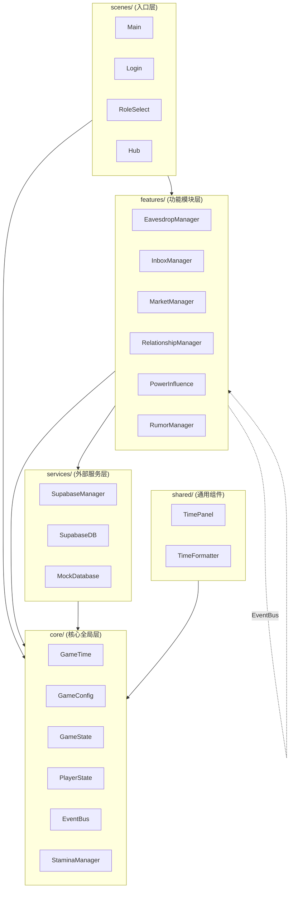

# 红楼回忆志 - 项目架构文档

> 最后更新：2026-03-18

---

## 1. 项目概览

| 项目信息 | 说明 |
|---------|------|
| **游戏名称** | 红楼回忆志 |
| **游戏引擎** | Godot 4.6 |
| **渲染后端** | D3D12 (Windows) / Mobile |
| **游戏类型** | 文字冒险 + 模拟经营 + 情报收集 |
| **后端服务** | Supabase (PostgreSQL + Realtime + Edge Functions) |
| **目标平台** | PC / Mobile |

### 游戏背景
玩家扮演《红楼梦》大观园中的不同阶层角色（管家、主子、丫鬟、元老、清客），
通过情报收集、流言传播、权势斗争等方式，在家族衰败过程中寻求个人出路。

---

## 2. 目录结构说明

### 2.1 core/ - 核心全局层

存放所有模块依赖的全局单例和核心系统。

| 文件 | 职责说明 |
|------|---------|
| `GameTime.gd` | 时间系统核心单例，负责游戏时间与现实时间的映射计算及同步 |
| `GameConfig.gd` | 全局配置常量，包含环境配置、数值初始值、精力系统常量等 |
| `GameState.gd` | 全局游戏状态，管理公中银两、家族亏空、内耗值、游戏日等 |
| `PlayerState.gd` | 玩家本地状态，管理玩家属性（精力、气数、银两、体面、名望等） |
| `EventBus.gd` | 全局信号总线，解耦跨场景/模块通信 |
| `StaminaManager.gd` | 精力管理器，处理管家精力系统的本地计算与同步 |
| `constants/GameConstants.gd` | 所有数值常量集中定义（瓦片尺寸、玩家属性、碰撞阈值等） |
| `constants/AssetPaths.gd` | 统一资源加载与访问 |
| `systems/` | 核心游戏系统（2D 瓦片框架相关） |

### 2.2 services/ - 外部服务层

封装与外部服务的交互，提供统一的数据访问接口。

```
services/supabase/
├── SupabaseManager.gd    # 统一入口：连接初始化、用户鉴权、实时订阅
├── SupabaseDB.gd         # 数据读写操作：GET/POST/PATCH/DELETE/RPC
└── MockDatabase.gd       # 本地测试模拟数据库（无需网络）
```

**设计说明：**
- `SupabaseManager` 负责认证（登录/注册）、Realtime 订阅、WebSocket 连接
- `SupabaseDB` 负责所有数据库 CRUD 操作，通过 `set_manager()` 注入认证信息
- 两者通过组合模式协作，`SupabaseManager` 持有 `SupabaseDB` 实例并提供转发方法（向后兼容）

### 2.3 features/ - 功能模块层

每个模块独立自治，包含完整的业务逻辑、UI 和场景。

| 模块 | 职责说明 | 主要文件 |
|------|---------|---------|
| **eavesdrop/** | 听壁脚/挂机监听系统 | `EavesdropManager.gd`（会话管理、情报生成）、`EavesdropHub.gd`（挂机中心）、`EavesdropScene.gd`（挂机选择）、`IntelBag.gd`（情报背包）、`IntelTemplates.gd`（情报模板） |
| **inbox/** | 信箱/消息系统 | `InboxManager.gd`（消息加载、发送、实时订阅）、`InboxUI.gd`（主界面）、`MessageCard.gd`（消息卡片）、`ComposePanel.gd`（发信面板） |
| **market/** | 集市交易系统 | `BridgeMarket.gd`（情报交易逻辑）、`BridgeMarketUI.gd`（集市界面）、`ListingCard.gd`（商品卡片）、`MarketUI.gd`（主界面） |
| **relationship/** | 丫鬟关系系统 | `RelationshipManager.gd`（对食/私约/投靠逻辑）、`MaidProgressionChecker.gd`（三条成长路径检测）、`RelationshipPanel.gd`（关系面板）、`MaidProgressPanel.gd`（进度面板） |
| **power/** | 权势影响力系统 | `PowerInfluence.gd`（权势计算、连坐惩罚）、`PowerStatusIndicator.gd`（权势状态 UI 组件） |
| **rumor/** | 流言系统 | `RumorBoardUI.gd`（流言广场）、`RumorCard.gd`（流言卡片）、`PublishRumorPanel.gd`（发布流言）、`RumorFermentTimer.gd`（流言发酵计时） |
| **treasury/** | 账房系统 | `TreasuryUI.gd`（账房界面）、`Treasury.tscn`（场景） |
| **settlement/** | 清算系统 | `SettlementUI.gd`（清算界面）、`Settlement.tscn`（场景） |
| **poetry/** | 诗社系统 | `PoetryHallUI.gd`（诗社界面）、`PoetryHall.tscn`（场景） |

### 2.4 shared/ - 跨模块共享

| 子目录 | 用途 | 内容 |
|-------|------|------|
| `components/` | 通用 UI 组件 | `TimePanel.gd/.tscn`（时间面板） |
| `utils/` | 工具函数 | `TimeFormatter.gd`（时间格式化工具） |

### 2.5 scenes/ - 顶层入口场景

| 子目录 | 用途 | 内容 |
|-------|------|------|
| `main/` | 主入口场景 | `Main.gd/.tscn`（游戏主入口）、`Login.gd/.tscn`（登录界面）、`RoleSelect.gd/.tscn`（角色选择）、`Hub.gd/.tscn`（大观园主界面） |
| `debug/` | 调试工具 | `DebugTimePanel.gd/.tscn`（调试时间面板）、`DebugPanelUI.gd`（调试面板） |

---

## 3. 模块依赖图



---

## 4. Autoload 加载顺序及依赖说明

### 4.1 加载顺序

```
┌─────────────────────────────────────────────────────────────────┐
│ 1. 调试组件（最顶层，独立）                                      │
│    DebugTimePanel                                               │
├─────────────────────────────────────────────────────────────────┤
│ 2. 核心全局层（所有模块依赖）                                    │
│    GameTime → GameConfig → GameState → PlayerState → EventBus → StaminaManager │
├─────────────────────────────────────────────────────────────────┤
│ 3. 外部服务层（数据存取依赖）                                    │
│    SupabaseManager → MockDatabase                               │
├─────────────────────────────────────────────────────────────────┤
│ 4. 功能模块层（业务逻辑）                                        │
│    EavesdropManager → RelationshipManager → MaidProgressionChecker → InboxManager → PowerInfluence │
└─────────────────────────────────────────────────────────────────┘
```

### 4.2 依赖说明

| Autoload | 依赖对象 | 说明 |
|---------|---------|------|
| `DebugTimePanel` | 无 | 独立调试组件，仅调试模式下加载 |
| `GameTime` | 无 | 时间系统核心，被所有需要时间计算的模块依赖 |
| `GameConfig` | 无 | 全局配置常量，被所有模块读取 |
| `GameState` | `GameConfig` | 全局状态，依赖 GameConfig 的阈值常量 |
| `PlayerState` | `GameConfig` | 玩家状态，依赖 GameConfig 的初始值和精力常量 |
| `EventBus` | 无 | 纯信号总线，无外部依赖 |
| `StaminaManager` | `SupabaseManager`, `GameConfig` | 精力计算，依赖 Supabase 获取数据和 GameConfig 的恢复常量 |
| `SupabaseManager` | `GameConfig` | 数据库服务，依赖 GameConfig 的 API 端点和认证配置 |
| `MockDatabase` | 无 | 本地测试模拟，无外部依赖 |
| `EavesdropManager` | `SupabaseManager`, `PlayerState`, `GameState`, `EventBus` | 挂机系统，依赖多个核心模块 |
| `RelationshipManager` | `SupabaseManager`, `PlayerState`, `EventBus` | 关系系统，依赖核心模块 |
| `MaidProgressionChecker` | `SupabaseManager`, `EventBus` | 成长路径检测，依赖 Supabase 和 EventBus |
| `InboxManager` | `SupabaseManager`, `PlayerState`, `RelationshipManager` | 信箱系统，依赖关系模块进行封锁检查 |
| `PowerInfluence` | `SupabaseManager` | 权势计算，依赖 Supabase 获取玩家数据 |

---

## 5. 新增模块标准流程

### 5.1 创建模块目录

```bash
features/
└── new_feature/          # 新建模块目录
    ├── NewFeature.gd     # 核心逻辑脚本（可选单例）
    ├── NewFeatureUI.gd   # UI 脚本
    ├── NewFeature.tscn   # 主场景
    └── ...               # 其他相关文件
```

### 5.2 创建核心脚本

```gdscript
# features/new_feature/NewFeature.gd
extends Node

# 如需全局访问，在脚本顶部定义信号和常量
signal feature_activated(data: Dictionary)

const FEATURE_CONFIG: Dictionary = {
    "key": "value"
}

# 业务逻辑方法
func do_something(param: String) -> bool:
    # 实现逻辑
    return true
```

### 5.3 注册 Autoload（如需全局单例）

1. 打开 `project.godot` 或通过编辑器：**项目 → 项目设置 → Autoload**
2. 添加新文件：`res://features/new_feature/NewFeature.gd`
3. 命名：`NewFeature`
4. 确保勾选启用

### 5.4 创建 UI 和场景

- `.tscn` 和 `.gd` 文件放在**同一目录**下
- 场景脚本使用相对路径引用同目录脚本：
  ```gdscript
  const NewFeatureUI = preload("res://features/new_feature/NewFeatureUI.gd")
  ```

### 5.5 通过 EventBus 与其他模块通信

```gdscript
# 发送事件
EventBus.feature_activated.emit({"key": "value"})

# 接收事件（在 _ready 中连接）
func _ready():
    EventBus.some_other_signal.connect(_on_some_other_signal)

func _on_some_other_signal(data: Dictionary):
    # 处理事件
    pass
```

### 5.6 更新文档

- 在 `docs/architecture.md` 的 **2.3 features/** 部分添加模块说明
- 在 **4.2 依赖说明** 部分添加新模块的依赖关系

---

## 6. 代码规范

### 6.1 类型注解

所有 GDScript 文件使用 GDScript 4 的类型注解：

```gdscript
# 函数参数和返回值
func calculate_damage(base: int, multiplier: float) -> int:
    return int(base * multiplier)

# 局部变量
var health: int = 100
var is_alive: bool = true
var items: Array = []
var metadata: Dictionary = {}

# 浮点数运算使用 clampf()/minf()/maxf()
var clamped_value: float = clampf(value, 0.0, 100.0)

# 整数运算使用 mini()/maxi()
var min_health: int = mini(health, 100)
```

### 6.2 路径规范

- 所有资源路径使用 `res://` 前缀
- 模块内引用使用相对路径或 `res://features/模块名/`
- 禁止跨模块直接引用内部文件，通过 `EventBus` 或公开 API 通信

### 6.3 信号命名

- 使用过去分词形式：`item_collected`, `level_completed`
- 携带必要数据参数：`signal player_moved(new_position: Vector2)`

---

## 7. 相关文档

- [本地开发环境设置](../LOCAL_SETUP_SUMMARY.md)
- [Supabase 衔接说明](../Supabase 衔接说明.md)
- [SQL 使用说明](../SQL 使用说明.md)
