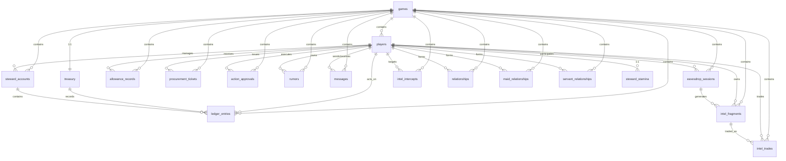

# 《红楼回忆志》数据库结构扫描报告

**数据库类型**: PostgreSQL 15 (Supabase)  
**扫描来源**: `supabase/sql/full_schema.sql`  
**业务领域**: 古风模拟经营游戏（管家/丫鬟/主子角色扮演 + 情报系统 + 经济系统）  
**扫描时间**: 2026-03-20

---

## 1. 表清单

| 序号 | 表名 | 用途说明 | 估算行数 |
|:---:|------|----------|:--------:|
| 1 | `games` | 游戏局表，记录每局游戏状态 | - |
| 2 | `players` | 玩家表，存储玩家基础属性 | - |
| 3 | `steward_stamina` | 管家精力表 | - |
| 4 | `treasury` | 银库表，记录公中银两 | - |
| 5 | `steward_accounts` | 管家账本表 | - |
| 6 | `ledger_entries` | 账本条目表 | - |
| 7 | `allowance_records` | 月例发放记录表 | - |
| 8 | `procurement_tickets` | 采办物资票据表 | - |
| 9 | `action_approvals` | 行动批条表 | - |
| 10 | `rumors` | 流言表 | - |
| 11 | `messages` | 消息表（私信/流言/批条等） | - |
| 12 | `eavesdrop_sessions` | 挂机监听会话表（听壁脚） | - |
| 13 | `intel_fragments` | 情报碎片表 | - |
| 14 | `intel_trades` | 情报交易表 | - |
| 15 | `intel_intercepts` | 情报拦截表 | - |
| 16 | `relationships` | 核心关系网表 | - |
| 17 | `maid_relationships` | 丫鬟关系表（对食/私约） | - |
| 18 | `servant_relationships` | 丫鬟关系申请表 | - |

**总表数**: 18 张

---

## 2. 字段详情

### 2.1 games（游戏局表）

| 字段名 | 类型 | NULL | 默认值 | 注释 |
|--------|------|:----:|--------|------|
| id | uuid | NO | gen_random_uuid() | 主键 |
| status | text | YES | 'active' | 状态：active/crisis/purge/ended |
| start_timestamp | bigint | NO | - | 开始时间戳 |
| end_timestamp | bigint | YES | - | 结束时间戳 |
| speed_multiplier | float | YES | 1.0 | 游戏速度倍率 |
| deficit_value | float | YES | 0.0 | 亏空值 |
| conflict_value | float | YES | 0.0 | 冲突值 |
| current_day | int | YES | 1 | 当前天数 |
| started_at | timestamptz | YES | now() | 实际开始时间 |
| ended_at | timestamptz | YES | - | 实际结束时间 |
| created_at | timestamptz | YES | now() | 创建时间 |
| updated_at | timestamptz | YES | now() | 更新时间 |

### 2.2 players（玩家表）

| 字段名 | 类型 | NULL | 默认值 | 注释 |
|--------|------|:----:|--------|------|
| id | uuid | NO | gen_random_uuid() | 主键 |
| auth_uid | uuid | NO | - | 认证 UID（唯一） |
| username | text | YES | - | 用户名（唯一） |
| display_name | text | NO | - | 显示名 |
| character_name | text | YES | - | 角色名 |
| role_class | text | NO | - | 角色类型：steward/master/servant/elder/guest |
| current_game_id | uuid | YES | - | 当前游戏局 ID（外键） |
| stamina | int | YES | 6 | 精力值 |
| stamina_max | int | YES | 6 | 精力上限 |
| stamina_refreshed_at | timestamptz | YES | now() | 精力刷新时间 |
| qi_points | int | YES | 100 | 气运点数 |
| silver | int | YES | 0 | 银两 |
| private_silver | int | YES | 0 | 私有银两 |
| reputation | int | YES | 50 | 声望 |
| face_value | int | YES | 50 | 面子值 |
| prestige | int | YES | 50 | 威望 |
| loyalty | int | YES | 50 | 忠诚度 |
| created_at | timestamptz | YES | now() | 创建时间 |
| updated_at | timestamptz | YES | now() | 更新时间 |

### 2.3 steward_stamina（管家精力表）

| 字段名 | 类型 | NULL | 默认值 | 注释 |
|--------|------|:----:|--------|------|
| uid | uuid | NO | - | 主键（引用 players.id） |
| current_stamina | int | YES | 6 | 当前精力 |
| max_stamina | int | YES | 6 | 精力上限 |
| last_refresh_at | timestamptz | YES | now() | 最后刷新时间 |

### 2.4 treasury（银库表）

| 字段名 | 类型 | NULL | 默认值 | 注释 |
|--------|------|:----:|--------|------|
| game_id | uuid | NO | - | 主键（引用 games.id） |
| total_silver | int | YES | 50000 | 总银两 |
| daily_budget | int | YES | 2000 | 日预算 |
| public_balance | int | YES | 50000 | 公开余额 |
| real_balance | int | YES | 50000 | 实际余额 |
| prosperity_level | int | YES | 8 | 繁荣等级 |
| deficit_rate | float | YES | 0.0 | 亏空率 |
| last_update | timestamptz | YES | now() | 最后更新时间 |

### 2.5 steward_accounts（管家账本表）

| 字段名 | 类型 | NULL | 默认值 | 注释 |
|--------|------|:----:|--------|------|
| id | uuid | NO | gen_random_uuid() | 主键 |
| game_id | uuid | NO | - | 游戏局 ID（外键） |
| steward_uid | uuid | NO | - | 管家 UID（外键） |
| public_ledger | jsonb | YES | '[]' | 公开账本 |
| private_ledger | jsonb | YES | '[]' | 私有账本 |
| private_assets | int | YES | 0 | 私有资产 |
| prestige | int | YES | 50 | 威望 |
| route | steward_route | YES | 'undecided' | 路线：virtuous/schemer/undecided |
| created_at | timestamptz | YES | now() | 创建时间 |
| updated_at | timestamptz | YES | now() | 更新时间 |

### 2.6 ledger_entries（账本条目表）

| 字段名 | 类型 | NULL | 默认值 | 注释 |
|--------|------|:----:|--------|------|
| id | uuid | NO | gen_random_uuid() | 主键 |
| game_id | uuid | NO | - | 游戏局 ID |
| treasury_id | uuid | YES | - | 银库 ID（外键） |
| actor_id | uuid | NO | - | 操作者 ID（外键） |
| target_id | uuid | YES | - | 目标 ID（外键） |
| ledger_type | text | YES | 'public' | 账本类型：public/private |
| entry_type | text | YES | 'allocation' | 条目类型：allocation/procurement/advance/other |
| amount | int | YES | 0 | 金额 |
| note | text | YES | - | 备注 |
| created_at | timestamptz | YES | now() | 创建时间 |
| updated_at | timestamptz | YES | now() | 更新时间 |

### 2.7 allowance_records（月例发放记录表）

| 字段名 | 类型 | NULL | 默认值 | 注释 |
|--------|------|:----:|--------|------|
| id | uuid | NO | gen_random_uuid() | 主键 |
| game_id | uuid | NO | - | 游戏局 ID |
| player_id | uuid | YES | - | 玩家 ID |
| issued_by | uuid | YES | - | 发放者 ID |
| amount_public | int | NO | - | 公开金额 |
| amount_actual | int | NO | - | 实际金额 |
| withheld_amount | int | YES | 0 | 克扣金额 |
| is_public | boolean | YES | true | 是否公开 |
| issued_at | timestamptz | YES | now() | 发放时间 |
| created_at | timestamptz | YES | now() | 创建时间 |

### 2.8 procurement_tickets（采办物资票据表）

| 字段名 | 类型 | NULL | 默认值 | 注释 |
|--------|------|:----:|--------|------|
| id | uuid | NO | gen_random_uuid() | 主键 |
| game_id | uuid | NO | - | 游戏局 ID |
| steward_uid | uuid | NO | - | 管家 UID |
| item_template_key | text | NO | - | 物品模板键 |
| quantity | int | NO | 1 | 数量（>0） |
| status | text | NO | 'pending' | 状态：pending/used/cancelled |
| created_at | timestamptz | YES | now() | 创建时间 |
| used_at | timestamptz | YES | - | 使用时间 |

### 2.9 action_approvals（行动批条表）

| 字段名 | 类型 | NULL | 默认值 | 注释 |
|--------|------|:----:|--------|------|
| id | uuid | NO | gen_random_uuid() | 主键 |
| game_id | uuid | NO | - | 游戏局 ID |
| steward_uid | uuid | NO | - | 管家 UID |
| action_type | text | NO | - | 行动类型 |
| target_id | uuid | YES | - | 目标 ID |
| stamina_cost | int | NO | - | 精力消耗 |
| params | jsonb | YES | '{}' | 行动参数 |
| status | text | YES | 'pending' | 状态：pending/executed/cancelled |
| executed_at | timestamptz | YES | - | 执行时间 |
| created_at | timestamptz | YES | now() | 创建时间 |

### 2.10 rumors（流言表）

| 字段名 | 类型 | NULL | 默认值 | 注释 |
|--------|------|:----:|--------|------|
| id | uuid | NO | gen_random_uuid() | 主键 |
| game_id | uuid | NO | - | 游戏局 ID |
| owner_uid | uuid | NO | - | 所有者 UID |
| source_uid | uuid | YES | - | 来源 UID |
| target_uid | uuid | YES | - | 目标 UID |
| content | text | NO | - | 内容 |
| stage | int | YES | 1 | 阶段：1-4 |
| spread_count | int | YES | 0 | 传播次数 |
| belief_rate | float | YES | 0.5 | 相信率 |
| status | text | YES | 'active' | 状态：active/suppressed/expired |
| created_at | timestamptz | YES | now() | 创建时间 |
| expires_at | timestamptz | YES | now() + 24h | 过期时间 |

### 2.11 messages（消息表）

| 字段名 | 类型 | NULL | 默认值 | 注释 |
|--------|------|:----:|--------|------|
| id | uuid | NO | gen_random_uuid() | 主键 |
| game_id | uuid | NO | - | 游戏局 ID |
| sender_uid | uuid | NO | - | 发送者 UID |
| receiver_uid | uuid | NO | - | 接收者 UID |
| message_type | text | NO | 'private' | 类型：private/rumor/batch_order/system/petition/accusation |
| content | text | NO | - | 内容 |
| attachments | jsonb | YES | '[]' | 附件 |
| stamina_cost | int | NO | 1 | 精力消耗 |
| is_read | boolean | YES | false | 是否已读 |
| is_tampered | boolean | YES | false | 是否被篡改 |
| original_content | text | YES | - | 原始内容 |
| is_intercepted | boolean | YES | false | 是否被截留 |
| stage | int | NO | 0 | 流言阶段：0-2 |
| expires_at | timestamptz | YES | - | 过期时间 |
| status | message_status | YES | 'pending' | 状态：pending/delivered/intercepted/tampered |
| created_at | timestamptz | YES | now() | 创建时间 |
| read_at | timestamptz | YES | - | 阅读时间 |

### 2.12 eavesdrop_sessions（挂机监听会话表）

| 字段名 | 类型 | NULL | 默认值 | 注释 |
|--------|------|:----:|--------|------|
| id | uuid | NO | gen_random_uuid() | 主键 |
| game_id | uuid | NO | - | 游戏局 ID |
| player_uid | uuid | NO | - | 玩家 UID |
| scene | scene_location | NO | - | 场景 |
| scene_key | text | NO | - | 场景键值 |
| partner_uid | uuid | YES | - | 双人搭档 UID |
| is_duo | boolean | YES | false | 是否双人挂机 |
| success_rate_mod | real | YES | 1.0 | 成功率修正 |
| starts_at | timestamptz | YES | now() | 开始时间 |
| ends_at | timestamptz | NO | - | 结束时间 |
| status | session_status | YES | 'active' | 状态 |
| result_count | int | YES | 0 | 情报结果数 |
| created_at | timestamptz | YES | now() | 创建时间 |

### 2.13 intel_fragments（情报碎片表）

| 字段名 | 类型 | NULL | 默认值 | 注释 |
|--------|------|:----:|--------|------|
| id | uuid | NO | gen_random_uuid() | 主键 |
| game_id | uuid | NO | - | 游戏局 ID |
| owner_uid | uuid | NO | - | 所有者 UID |
| source_uid | uuid | YES | - | 来源 UID |
| session_id | uuid | YES | - | 会话 ID |
| content | text | NO | - | 内容 |
| intel_type | intel_type | NO | - | 类型 |
| scene | text | YES | - | 场景 |
| scene_key | text | YES | - | 场景键值 |
| value_level | int | YES | 1 | 价值等级：1-5 |
| status | text | YES | 'unread' | 状态 |
| is_used | boolean | YES | false | 是否已使用 |
| is_sold | boolean | YES | false | 是否已出售 |
| is_blocked | boolean | YES | false | 是否被封锁 |
| blocked_until | timestamptz | YES | - | 封锁截止时间 |
| blocked_by | uuid | YES | - | 封锁者 UID |
| obtained_at | timestamptz | YES | now() | 获取时间 |
| expires_at | timestamptz | YES | now() + 48h | 过期时间 |
| created_at | timestamptz | YES | now() | 创建时间 |

### 2.14 intel_trades（情报交易表）

| 字段名 | 类型 | NULL | 默认值 | 注释 |
|--------|------|:----:|--------|------|
| id | uuid | NO | gen_random_uuid() | 主键 |
| game_id | uuid | NO | - | 游戏局 ID |
| seller_uid | uuid | NO | - | 卖家 UID |
| buyer_uid | uuid | NO | - | 买家 UID |
| fragment_id | uuid | NO | - | 情报碎片 ID |
| price_silver | int | YES | 0 | 银两价格 |
| price_qi | int | YES | 0 | 气运价格 |
| status | trade_status | YES | 'pending' | 状态 |
| traded_at | timestamptz | YES | - | 交易时间 |
| created_at | timestamptz | YES | now() | 创建时间 |

### 2.15 intel_intercepts（情报拦截表）

| 字段名 | 类型 | NULL | 默认值 | 注释 |
|--------|------|:----:|--------|------|
| id | uuid | NO | gen_random_uuid() | 主键 |
| game_id | uuid | NO | - | 游戏局 ID |
| interceptor_uid | uuid | NO | - | 拦截者 UID |
| target_uid | uuid | NO | - | 目标 UID |
| starts_at | timestamptz | YES | now() | 开始时间 |
| ends_at | timestamptz | NO | - | 结束时间 |
| status | text | YES | 'active' | 状态 |
| created_at | timestamptz | YES | now() | 创建时间 |

### 2.16 relationships（核心关系网表）

| 字段名 | 类型 | NULL | 默认值 | 注释 |
|--------|------|:----:|--------|------|
| id | uuid | NO | gen_random_uuid() | 主键 |
| game_id | uuid | NO | - | 游戏局 ID |
| player_a | uuid | NO | - | 玩家 A |
| player_b | uuid | NO | - | 玩家 B |
| relation_type | text | NO | - | 类型 |
| initiated_by | uuid | YES | - | 发起者 |
| is_mutual | boolean | YES | false | 是否双向 |
| created_at | timestamptz | YES | now() | 创建时间 |
| updated_at | timestamptz | YES | now() | 更新时间 |

### 2.17 maid_relationships（丫鬟关系表）

| 字段名 | 类型 | NULL | 默认值 | 注释 |
|--------|------|:----:|--------|------|
| id | uuid | NO | gen_random_uuid() | 主键 |
| game_id | uuid | NO | - | 游戏局 ID |
| player_a_uid | uuid | NO | - | 玩家 A UID |
| player_b_uid | uuid | NO | - | 玩家 B UID |
| relation_type | maid_relation_type | NO | - | 类型：dui_shi/si_yue |
| status | maid_relation_status | YES | 'pending' | 状态 |
| initiated_by | uuid | YES | - | 发起者 |
| formed_at | timestamptz | YES | - | 建立时间 |
| shared_intel_ids | uuid[] | YES | '{}' | 共享情报 ID 列表 |
| betrayer_uid | uuid | YES | - | 背叛者 UID |
| created_at | timestamptz | YES | now() | 创建时间 |
| updated_at | timestamptz | YES | now() | 更新时间 |

### 2.18 servant_relationships（丫鬟关系申请表）

| 字段名 | 类型 | NULL | 默认值 | 注释 |
|--------|------|:----:|--------|------|
| id | uuid | NO | gen_random_uuid() | 主键 |
| game_id | uuid | NO | - | 游戏局 ID |
| servant_a | uuid | NO | - | 丫鬟 A |
| servant_b | uuid | NO | - | 丫鬟 B |
| relation_type | text | NO | - | 关系类型 |
| status | text | YES | 'pending' | 状态 |
| created_at | timestamptz | YES | now() | 创建时间 |
| updated_at | timestamptz | YES | now() | 更新时间 |

---

## 3. 索引清单

### 3.1 主键索引（Primary Keys）

| 表名 | 主键字段 |
|------|----------|
| games | id |
| players | id |
| steward_stamina | uid |
| treasury | game_id |
| steward_accounts | id |
| ledger_entries | id |
| allowance_records | id |
| procurement_tickets | id |
| action_approvals | id |
| rumors | id |
| messages | id |
| eavesdrop_sessions | id |
| intel_fragments | id |
| intel_trades | id |
| intel_intercepts | id |
| relationships | id |
| maid_relationships | id |
| servant_relationships | id |

### 3.2 唯一索引（Unique Constraints）

| 表名 | 字段组合 |
|------|----------|
| players | auth_uid |
| players | username |
| steward_accounts | (game_id, steward_uid) |
| relationships | (game_id, player_a, player_b, relation_type) |
| maid_relationships | (game_id, player_a_uid, player_b_uid, relation_type) |

### 3.3 普通索引

| 索引名 | 表名 | 字段 |
|--------|------|------|
| idx_messages_game_receiver | messages | (game_id, receiver_uid) |
| idx_messages_type | messages | (message_type) |
| idx_messages_sender | messages | (sender_uid) |
| idx_eavesdrop_sessions_active | eavesdrop_sessions | (game_id, status, scene_key) |
| idx_eavesdrop_sessions_player | eavesdrop_sessions | (player_uid, status) |
| idx_eavesdrop_sessions_scene | eavesdrop_sessions | (game_id, scene_key, status) |
| idx_intel_fragments_owner | intel_fragments | (owner_uid, is_sold, is_used, expires_at) |
| idx_intel_fragments_session | intel_fragments | (session_id) |
| idx_intel_fragments_game | intel_fragments | (game_id) |
| idx_intel_fragments_scene | intel_fragments | (scene) |
| idx_intel_intercepts_target | intel_intercepts | (target_uid, status, ends_at) |
| idx_intel_intercepts_game | intel_intercepts | (game_id, status) |
| idx_procurement_tickets_game | procurement_tickets | (game_id) |
| idx_procurement_tickets_steward | procurement_tickets | (steward_uid) |

---

## 4. 外键 & 约束

### 4.1 外键关系

| 子表 | 子字段 | 父表 | 父子段 |
|------|--------|------|--------|
| players | current_game_id | games | id |
| steward_stamina | uid | players | id |
| treasury | game_id | games | id |
| steward_accounts | game_id | games | id |
| steward_accounts | steward_uid | players | id |
| ledger_entries | game_id | games | id |
| ledger_entries | treasury_id | treasury | game_id |
| ledger_entries | actor_id | players | id |
| ledger_entries | target_id | players | id |
| allowance_records | game_id | games | id |
| allowance_records | player_id | players | id |
| allowance_records | issued_by | players | id |
| procurement_tickets | game_id | games | id |
| procurement_tickets | steward_uid | players | id |
| action_approvals | game_id | games | id |
| action_approvals | steward_uid | players | id |
| action_approvals | target_id | players | id |
| rumors | game_id | games | id |
| rumors | owner_uid | players | id |
| rumors | source_uid | players | id |
| rumors | target_uid | players | id |
| messages | game_id | games | id |
| messages | sender_uid | players | id |
| messages | receiver_uid | players | id |
| eavesdrop_sessions | game_id | games | id |
| eavesdrop_sessions | player_uid | players | id |
| eavesdrop_sessions | partner_uid | players | id |
| intel_fragments | game_id | games | id |
| intel_fragments | owner_uid | players | id |
| intel_fragments | source_uid | players | id |
| intel_fragments | session_id | eavesdrop_sessions | id |
| intel_fragments | blocked_by | players | id |
| intel_trades | game_id | games | id |
| intel_trades | seller_uid | players | id |
| intel_trades | buyer_uid | players | id |
| intel_trades | fragment_id | intel_fragments | id |
| intel_intercepts | game_id | games | id |
| intel_intercepts | interceptor_uid | players | id |
| intel_intercepts | target_uid | players | id |
| relationships | game_id | games | id |
| relationships | player_a | players | id |
| relationships | player_b | players | id |
| relationships | initiated_by | players | id |
| maid_relationships | game_id | games | id |
| maid_relationships | player_a_uid | players | id |
| maid_relationships | player_b_uid | players | id |
| maid_relationships | initiated_by | players | id |
| maid_relationships | betrayer_uid | players | id |
| servant_relationships | game_id | games | id |
| servant_relationships | servant_a | players | id |
| servant_relationships | servant_b | players | id |

### 4.2 Check 约束

| 表名 | 字段 | 约束条件 |
|------|------|----------|
| players | role_class | IN ('steward', 'master', 'servant', 'elder', 'guest') |
| games | status | IN ('active', 'crisis', 'purge', 'ended') |
| ledger_entries | ledger_type | IN ('public', 'private') |
| ledger_entries | entry_type | IN ('allocation', 'procurement', 'advance', 'other') |
| procurement_tickets | quantity | > 0 |
| procurement_tickets | status | IN ('pending', 'used', 'cancelled') |
| action_approvals | status | IN ('pending', 'executed', 'cancelled') |
| rumors | stage | BETWEEN 1 AND 4 |
| rumors | status | IN ('active', 'suppressed', 'expired') |
| messages | message_type | IN ('private', 'rumor', 'batch_order', 'system', 'petition', 'accusation') |
| messages | status | IN ('pending', 'delivered', 'intercepted', 'tampered') |
| eavesdrop_sessions | status | IN ('active', 'completed', 'interrupted', 'cancelled') |
| intel_fragments | value_level | BETWEEN 1 AND 5 |
| intel_fragments | status | IN ('unread', 'read', 'used') |
| intel_trades | status | IN ('pending', 'completed', 'cancelled') |
| intel_intercepts | status | IN ('active', 'expired', 'cancelled') |
| relationships | relation_type | IN ('ally', 'rival', 'confidant', 'admirer', 'duo_wiretap', 'betrayed') |

### 4.3 依赖关系图（Mermaid ERD）

---

## 5. 存储过程 & 触发器

### 5.1 触发器函数

| 名称 | 用途 |
|------|------|
| `update_updated_at_column()` | 通用更新时间触发器函数，自动设置 `updated_at = NOW()` |

### 5.2 存储函数（RPC）

| 函数名 | 参数 | 返回值 | 用途 |
|--------|------|--------|------|
| `get_my_player_id()` | 无 | uuid | 获取当前玩家 ID（兼容本地/云端） |
| `get_session_remaining_time()` | p_session_id | integer | 获取会话剩余时间（秒） |
| `get_player_active_session_count()` | p_player_uid | integer | 获取玩家活跃会话数 |
| `get_scene_listener_count()` | p_game_id, p_scene_key | integer | 获取场景监听人数 |
| `is_player_intercepted()` | p_player_uid | boolean | 检查玩家是否被拦截 |
| `require_steward_and_consume_stamina()` | p_cost | (steward_id, game_id, remaining_stamina) | 管家身份校验 + 精力结算扣减 |
| `steward_procure_goods()` | p_item_template_key, p_quantity | json | 采办物资 |
| `steward_assign_task()` | p_target_uid, p_silver_reward, p_task_type | json | 差使分派 |
| `steward_advance_credit()` | p_target_uid, p_amount, p_deficit_step | json | 预支批条 |
| `steward_search_players()` | p_min_count, p_max_count, p_love_letter_rate, p_account_fragment_rate | json | 搜检玩家 |
| `steward_suppress_rumor()` | p_rumor_id | json | 平息流言 |
| `steward_block_intel()` | p_intel_id | json | 封锁消息 |

---

## 6. 视图清单

**无显式视图定义**

---

## 7. 枚举类型

| 类型名 | 取值 |
|--------|------|
| `steward_route` | virtuous, schemer, undecided |
| `action_type` | procurement, assignment, search, advance, suppress_rumor, block_intel |
| `approval_status` | pending, executed, cancelled |
| `audit_status` | filed, investigating, concluded |
| `audit_verdict` | acquitted, demoted, catastrophe |
| `intel_type` | account_leak, private_action, gift_record, visitor_info, elder_favor, dui_shi |
| `scene_location` | yi_hong_yuan, treasury_back, bridge, gate, elder_room, remote_rockery, empty_room |
| `session_status` | active, completed, interrupted, cancelled |
| `message_status` | pending, delivered, intercepted, tampered |
| `trade_status` | pending, completed, cancelled |
| `maid_relation_type` | dui_shi, si_yue |
| `maid_relation_status` | pending, active, betrayed, dissolved |
| `relation_type` | ally, rival, confidant, admirer, duo_wiretap, betrayed |

---

## 8. 扫描摘要

| 指标 | 数值 |
|------|------|
| **总表数** | 18 张 |
| **总字段数** | 约 230+ 个 |
| **最大表**（字段数） | `messages` (17 字段)、`intel_fragments` (19 字段)、`players` (19 字段) |
| **外键总数** | 45+ 个 |
| **索引总数** | 19 个（5 唯一 + 14 普通） |
| **存储函数** | 12 个 |
| **枚举类型** | 13 个 |
| **触发器函数** | 1 个 |

### 冗余表候选

| 表名 | 理由 |
|------|------|
| `steward_stamina` | 与 `players` 表的 stamina 字段重复，可合并 |
| `servant_relationships` | 与 `maid_relationships` 功能相似，可能为历史遗留 |
