# 《红楼回忆志》数据库依赖图谱分析报告

**分析日期**: 2026-03-20  
**代码库规模**: 62 个 GDScript 文件 + 13 个 TypeScript 函数  
**数据库类型**: PostgreSQL 15 (Supabase)

---

## 1. 表 - 服务矩阵（热力图）

```
图例：█=写入  ▓=读取  ░=少量访问  ·=无访问

┌─────────────────────────────┬──────┬──────┬──────┬──────┬──────┬──────┬──────┬──────┬──────┬──────┬──────┬──────┬──────┬──────┬──────┬──────┬──────┬
│ 表名                        │Treasury│Inbox │Eavesd│Relat │Rumor │Login │Debug │Asset │Power │Market│Poetry│Settle│Stamina│GameSt│MockDB│Total │
├─────────────────────────────┼──────┼──────┼──────┼──────┼──────┼──────┼──────┼──────┼──────┼──────┼──────┼──────┼──────┼──────┼──────┼──────┼──────┤
│ players                     │ ███  │ ███  │ ███  │ ███  │ ███  │ ███  │ ███  │ ██   │ ███  │ ██   │ ·    │ ·    │ ██   │ ██   │ ███  │ 15   │ ██████│
│ messages                    │ ·    │ ███  │ ·    │ ██   │ ███  │ ·    │ ·    │ ·    │ ·    │ ·    │ ·    │ ·    │ ·    │ ·    │ ·    │ 5    │ ███   │
│ eavesdrop_sessions          │ ·    │ ·    │ ███  │ ·    │ ·    │ ·    │ ██   │ ·    │ ·    │ ·    │ ·    │ ·    │ ·    │ ·    │ ·    │ 3    │ ██    │
│ intel_fragments             │ ·    │ ·    │ ███  │ ██   │ ·    │ ·    │ ██   │ ·    │ ·    │ ██   │ ·    │ ·    │ ·    │ ·    │ ·    │ 5    │ ███   │
│ intel_trades                │ ·    │ ·    │ ·    │ ·    │ ·    │ ·    │ ·    │ ·    │ ·    │ ███  │ ·    │ ·    │ ·    │ ·    │ ·    │ 1    │ █     │
│ intel_intercepts            │ ·    │ ·    │ ██   │ ·    │ ·    │ ·    │ ·    │ ·    │ ·    │ ·    │ ·    │ ·    │ ·    │ ·    │ ·    │ 1    │ █     │
│ maid_relationships          │ ·    │ ·    │ ·    │ ███  │ ·    │ ·    │ ·    │ ·    │ ·    │ ·    │ ·    │ ·    │ ·    │ ·    │ ██   │ 2    │ ██    │
│ maid_loyalty                │ ·    │ ·    │ ·    │ ███  │ ·    │ ·    │ ██   │ ·    │ ██   │ ·    │ ·    │ ·    │ ·    │ ·    │ ·    │ 4    │ ██    │
│ rumors                      │ ·    │ ██   │ ·    │ ·    │ ███  │ ·    │ ·    │ ·    │ ·    │ ·    │ ·    │ ·    │ ·    │ ·    │ ·    │ 2    │ ██    │
│ steward_accounts            │ ███  │ ·    │ ·    │ ·    │ ·    │ ██   │ ·    │ ·    │ ·    │ ·    │ ·    │ ·    │ ·    │ ·    │ ██   │ 4    │ ███   │
│ treasury                    │ ███  │ ·    │ ·    │ ·    │ ·    │ ·    │ ·    │ ·    │ ·    │ ·    │ ·    │ ·    │ ·    │ ·    │ ·    │ 1    │ █     │
│ allowance_records           │ ███  │ ·    │ ·    │ ·    │ ·    │ ·    │ ·    │ ·    │ ·    │ ·    │ ·    │ ·    │ ·    │ ·    │ ██   │ 2    │ ██    │
│ games                       │ ██   │ ·    │ ·    │ ·    │ ·    │ ·    │ ·    │ ·    │ ·    │ ·    │ ·    │ ·    │ ·    │ ███  │ ·    │ 3    │ ██    │
│ notifications               │ ·    │ ·    │ ·    │ ███  │ ·    │ ·    │ ·    │ ·    │ ·    │ ·    │ ·    │ ·    │ ·    │ ·    │ ██   │ 2    │ ██    │
│ event_logs                  │ ·    │ ·    │ ·    │ ██   │ ·    │ ·    │ ·    │ ·    │ ·    │ ·    │ ·    │ ·    │ ·    │ ·    │ ·    │ 1    │ █     │
│ player_status               │ ·    │ ·    │ ·    │ ██   │ ·    │ ·    │ ·    │ ·    │ ·    │ ·    │ ·    │ ·    │ ·    │ ·    │ ·    │ 1    │ █     │
│ asset_transfers             │ ·    │ ·    │ ·    │ ·    │ ·    │ ·    │ ·    │ ██   │ ·    │ ·    │ ·    │ ·    │ ·    │ ·    │ ·    │ 1    │ █     │
│ blocked_players             │ ·    │ ██   │ ·    │ ·    │ ·    │ ·    │ ·    │ ·    │ ·    │ ·    │ ·    │ ·    │ ·    │ ·    │ ·    │ 1    │ █     │
│ inbox_status                │ ·    │ ██   │ ·    │ ·    │ ·    │ ·    │ ·    │ ·    │ ·    │ ·    │ ·    │ ·    │ ·    │ ·    │ ·    │ 1    │ █     │
│ deficit_log                 │ ██   │ ·    │ ·    │ ·    │ ·    │ ·    │ ·    │ ·    │ ·    │ ·    │ ·    │ ·    │ ·    │ ·    │ ·    │ 1    │ █     │
│ actions                     │ ·    │ ·    │ ██   │ ·    │ ·    │ ·    │ ·    │ ·    │ ·    │ ·    │ ·    │ ·    │ ·    │ ·    │ ·    │ 1    │ █     │
│ steward_stamina             │ ·    │ ·    │ ·    │ ·    │ ·    │ ·    │ ·    │ ·    │ ·    │ ·    │ ·    │ ██   │ ·    │ ·    │ ·    │ 1    │ █     │
│ special_events              │ ·    │ ·    │ ·    │ ·    │ ·    │ ·    │ ·    │ ·    │ ·    │ ·    │ ·    │ ·    │ ·    │ ·    │ ·    │ 1    │ █     │
│ achievements                │ ·    │ ·    │ ·    │ ·    │ ·    │ ·    │ ·    │ ·    │ ·    │ ·    │ ·    │ ·    │ ·    │ ·    │ ·    │ 1    │ █     │
└─────────────────────────────┴──────┴──────┴──────┴──────┴──────┴──────┴──────┴──────┴──────┴──────┴──────┴──────┴──────┴──────┴──────┴──────┴──────┘
```

---

## 2. 高耦合表（重构高风险）

### 被 3 个以上服务/模块写入的表

| 排名 | 表名 | 写入模块数 | 读取模块数 | 总调用频次 | 风险等级 |
|:---:|------|:---------:|:---------:|:---------:|:--------:|
| 1 | `players` | 6 | 15 | 50+ | 🔴 **极高** |
| 2 | `messages` | 3 | 5 | 20+ | 🟡 **高** |
| 3 | `intel_fragments` | 3 | 5 | 18+ | 🟡 **高** |
| 4 | `steward_accounts` | 2 | 4 | 15+ | 🟠 **中高** |
| 5 | `maid_relationships` | 2 | 2 | 12+ | 🟠 **中高** |

### 高风险表详细分析

#### `players` 表（风险等级：🔴 极高）

**写入来源**:
```
TreasuryUI.gd        → 更新银两、精力
InboxManager.gd      → 读取角色信息
RelationshipManager  → 读取/更新忠诚度、体面值
Login.gd             → 插入/查询玩家记录
EavesdropManager.gd  → 读取玩家信息
TreasuryUI.gd        → 批量更新发放记录
```

**重构影响**: 任何字段变更将影响 **6+ 个模块**

---

## 3. 孤立表（候选废弃）

基于代码扫描，以下表在 Schema 中定义但**未在业务代码中发现直接引用**:

| 表名 | 定义位置 | 潜在用途 | 建议 |
|------|----------|----------|------|
| `servant_relationships` | full_schema.sql | 丫鬟关系申请 | ⚠️ 可能已被 `maid_relationships` 替代 |
| `ledger_entries` | full_schema.sql | 独立账本条目 | ⚠️ 功能被 `steward_accounts.public_ledger` (JSONB) 替代 |
| `procurement_tickets` | full_schema.sql | 采办票据 | 🟢 通过 RPC `steward_procure_goods` 间接使用 |
| `action_approvals` | full_schema.sql | 行动批条日志 | 🟢 通过 RPC 间接使用 |
| `relationships` | full_schema.sql | 通用关系网 | ⚠️ 功能被 `maid_relationships` 覆盖 |
| `steward_stamina` | full_schema.sql | 管家精力 | 🟢 通过 `StaminaManager.gd` 使用 |
| `intel_fragments.is_copy` | 未定义 | 情报副本标记 | ⚠️ 代码引用但 Schema 无此字段 |

---

## 4. 跨库/跨服务联表查询

### 4.1 显式 JOIN 查询

| 查询位置 | JOIN 逻辑 | 涉及表 |
|----------|-----------|--------|
| `TreasuryUI.gd:380` | `allowance_records` ⨝ `players` | 2 表 |
| `EavesdropManager.gd:296` | `eavesdrop_sessions` ⨝ `actions` | 2 表 |
| `RelationshipManager.gd:210` | `maid_relationships` ⨝ `players` (player_a) ⨝ `players` (player_b) | 3 表 |
| `RumorBoardUI.gd:110` | `rumors` ⨝ `players` (target_uid) | 2 表 |
| `BridgeMarketUI.gd:129` | `intel_trades` ⨝ `intel_fragments` | 2 表 |

### 4.2 Edge Function 跨表事务

| 函数名 | 涉及表 | 事务类型 |
|--------|--------|----------|
| `publish-rumor` | `players` → `intel_fragments` → `rumors` → `messages` | 多表原子写入 |
| `steward-api` | `treasury` ↔ `steward_accounts` | 资产转移 |
| `distribute-allowance` | `players` → `allowance_records` → `games` | 批量发放 |

---

## 5. 隐式依赖

### 5.1 硬编码表名引用

| 表名 | 引用位置 | 硬编码方式 |
|------|----------|------------|
| `players` | 20+ 处 | `"/rest/v1/players"` |
| `messages` | 15+ 处 | `"/rest/v1/messages"` |
| `eavesdrop_sessions` | 10+ 处 | `"/rest/v1/eavesdrop_sessions"` |
| `intel_fragments` | 10+ 处 | `"/rest/v1/intel_fragments"` |
| `maid_relationships` | 8+ 处 | `"/rest/v1/maid_relationships"` |

### 5.2 配置依赖

| 配置项 | 影响表 | 位置 |
|--------|--------|------|
| `GameConfig.LOCAL_API_BASE` | 所有表 | 本地/云端路由 |
| `PlayerState.current_game_id` | 所有业务表 | 游戏局隔离 |
| `SupabaseManager.current_uid` | 玩家相关表 | 用户鉴权 |

---

## 6. 服务→表调用关系图

```mermaid
flowchart TB
    subgraph Services["服务/模块层"]
        Treasury[TreasuryUI<br/>银库管理]
        Inbox[InboxManager<br/>信箱管理]
        Eavesdrop[EavesdropManager<br/>挂机监听]
        Relationship[RelationshipManager<br/>关系管理]
        Rumor[RumorBoard/Publish<br/>流言系统]
        Login[Login/RoleSelect<br/>登录认证]
        Market[MarketUI<br/>情报交易]
        Power[PowerInfluence<br/>权势影响]
    end

    subgraph DB["数据库层"]
        Players[(players)]
        Messages[(messages)]
        EavesdropSessions[(eavesdrop_sessions)]
        IntelFragments[(intel_fragments)]
        MaidRels[(maid_relationships)]
        MaidLoyalty[(maid_loyalty)]
        StewardAccounts[(steward_accounts)]
        Treasury_T[(treasury)]
        Allowance[(allowance_records)]
        Rumors[(rumors)]
        IntelTrades[(intel_trades)]
        Notifications[(notifications)]
    end

    %% Treasury 调用
    Treasury --> Players
    Treasury --> StewardAccounts
    Treasury --> Treasury_T
    Treasury --> Allowance
    Treasury --> Games[(games)]

    %% Inbox 调用
    Inbox --> Messages
    Inbox --> Players
    Inbox --> BlockedPlayers[(blocked_players)]

    %% Eavesdrop 调用
    Eavesdrop --> EavesdropSessions
    Eavesdrop --> IntelFragments
    Eavesdrop --> IntelIntercepts[(intel_intercepts)]
    Eavesdrop --> Players

    %% Relationship 调用
    Relationship --> MaidRels
    Relationship --> MaidLoyalty
    Relationship --> Players
    Relationship --> Notifications
    Relationship --> EventLogs[(event_logs)]

    %% Rumor 调用
    Rumor --> Rumors
    Rumor --> Messages
    Rumor --> Players
    Rumor --> IntelFragments

    %% Login 调用
    Login --> Players
    Login --> StewardAccounts

    %% Market 调用
    Market --> IntelTrades
    Market --> IntelFragments
    Market --> Players

    %% Power 调用
    Power --> MaidLoyalty
    Power --> Players

    %% 样式
    classDef highRisk fill:#ff6b6b,stroke:#c0392b,color:#fff
    classDef medRisk fill:#feca57,stroke:#ff9f43,color:#000
    classDef lowRisk fill:#48dbfb,stroke:#0abde3,color:#000

    class Players,Messages,IntelFragments highRisk
    class StewardAccounts,MaidRels,EavesdropSessions medRisk
    class Treasury_T,Allowance,Rumors lowRisk
```



---

## 7. 重构影响评分

### 评分公式
```
影响分 = 涉及服务数 × 调用频率权重 × 数据耦合度
```

| 排名 | 表名 | 涉及服务 | 调用频次 | 耦合度 | **影响分** | 风险等级 |
|:---:|------|:-------:|:-------:|:-----:|:---------:|:--------:|
| 1 | `players` | 6 | 50+ | 1.5 | **45.0** | 🔴 灾难性 |
| 2 | `messages` | 3 | 20+ | 1.2 | **7.2** | 🟠 高 |
| 3 | `intel_fragments` | 3 | 18+ | 1.0 | **5.4** | 🟠 高 |
| 4 | `steward_accounts` | 2 | 15+ | 1.0 | **3.0** | 🟡 中 |
| 5 | `maid_relationships` | 2 | 12+ | 1.0 | **2.4** | 🟡 中 |
| 6 | `eavesdrop_sessions` | 1 | 10+ | 0.8 | **0.8** | 🟢 低 |
| 7 | `treasury` | 1 | 5+ | 0.5 | **0.25** | 🟢 低 |
| 8 | `rumors` | 2 | 5+ | 0.5 | **0.5** | 🟢 低 |

---

## 8. 关键发现与建议

### 8.1 架构问题

| 问题 | 描述 | 建议 |
|------|------|------|
| 🔴 单表瓶颈 | `players` 表承载过多职责 | 拆分为 `player_profiles`、`player_stats`、`player_inventory` |
| 🟠 JSONB 滥用 | `steward_accounts.public_ledger` 使用 JSONB 存储数组 | 考虑恢复 `ledger_entries` 独立表 |
| 🟡 冗余设计 | `steward_stamina` 与 `players.stamina` 重复 | 合并到 `players` 表 |

### 8.2 代码规范建议

```gdscript
# ❌ 当前硬编码方式
var res = await SupabaseManager.db_get("/rest/v1/players?id=eq." + uid)

# ✅ 建议：使用表常量
const TABLE = {
    PLAYERS = "players",
    MESSAGES = "messages",
    # ...
}
var res = await SupabaseManager.query(TABLE.PLAYERS, {"id": uid})
```

### 8.3 测试覆盖盲区

| 表名 | 测试覆盖 | 缺失场景 |
|------|:-------:|----------|
| `intel_intercepts` | 0% | 拦截逻辑未测试 |
| `blocked_players` | 0% | 封锁功能未实现 |
| `deficit_log` | 0% | 亏空日志未使用 |

---

**报告生成完毕** 📊
